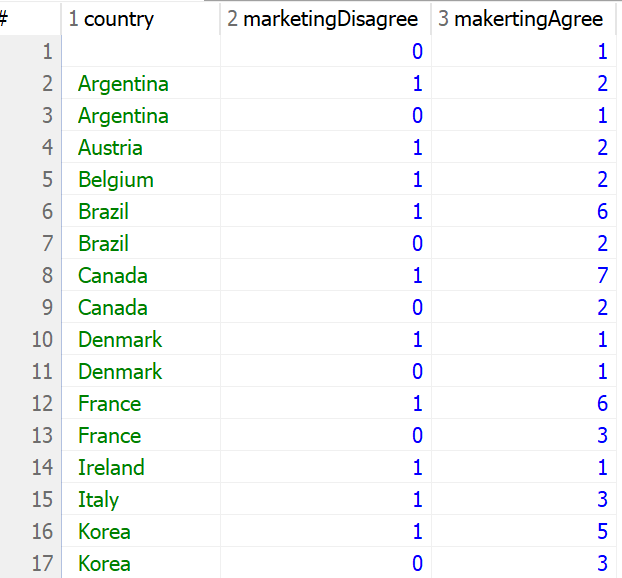
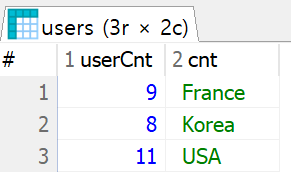
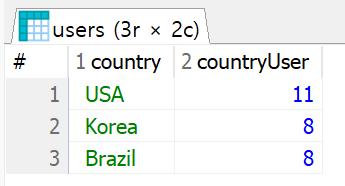
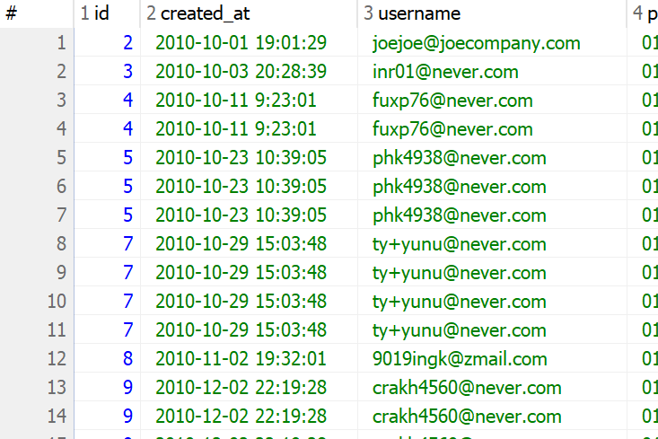

# 데이터를 계산하는 함수
- Excel에서도 합계 / 평균 / 개수 세기 등의 작업을 SQL에서도 구현 가능한데 문자열 슬라이싱, 대소문자 변경 등의 함수로 나뉜다
  
  1. 집계 함수 : 합 / 평균 / 개수 etc
  2. 일반 함수 : 문자열 slicing / 대소문자 변경 etc

### 그룹별로 집계 함수를 적용하기 위해 데이터를 나누는 GROUP BY
- 전체 데이터에 함수를 적용하기도 하지만 그룹별로 수치를 도출하는 경우도 많은데 이 경우 GROUP BY로 데이터를 그룹으로 묶은 후 필요한 함수 적용 방식

  - 국가별 회원 수를 집계
  - 일별 매출 계산

  등의 그룹화 기준을 지정해 계산 수행

### GROUP BY로 계산한 결과를 다시 필터랑 하는 HAVING
- GROUP BY는 그룹화 하는 용어로 위의 1번 사례의 회원 수 집계 까지만 가능. 하지만 거기에 더해 회원 수를 집계하고 10명 이상의 국가만 추출 등의 조건을 위해선 그룹화 이후 조건 설정 필요. 즉슨 집계 함수로 계산한 결과 중 조건에 맞는 데이터 설정

- 중요한 것은 WHERE는 table 자체에 걸리는 조건이기에 집계 함수 이전에 사용 불가능

### 집계함수
1. COUNTE() - 행(row)의 개수를 계산
2. AVG() - 평균
3. SUM() - 합


#### 1. 모든 행의 개수를 계산해서 출력 / country 컬럼의 데이터 개수를 계산해서 출력
```sql
SELECT COUNT(*) FROM users;
SELECT COUNT(country) FROM users;
```
NULL 체크 여부에 따라 77이 나와야 하지만 결과값은 76이 정상
- COUNT() 함수는 주어진 컬럼의 값이 null이 아닌 행의 개수를 반환

#### 2. 회원 정보 테이블 users에서 존재하는 국가(countrt)를 세는 SQL문(중복 제외)
```sql
SELECT COUNT(DISTINCT country) FROM users;
```
- DISTINCT : 중복을 제외한 결과값을 COUNT

#### 3. 예제 : 제품 정보 테이블 products에서 최저가를 출력(정상 가격 기준)
```sql
SELECT MIN(price) FROM products;
```

#### 4. 예제 : 제품 정보 테이블 products에서 최고가를 출력(정상 가격 기준)
```sql
SELECT MAX(price) FROM products;
```

#### 5. 예제 : products에서 정상 가격의 합계 출력
```sql
SELECT SUM(price) FROM products;
```

### 6. products에서 discount_price 기준으로 평균 출력
```sql
SELECT AVG(discount_price) FROM products;
```
결과값 : 34.427142857142854
는 너무 길어 달러화 기준 소수점 둘째자리만 표기하기 위해 중첩함수 사용
```sql
SELECT ROUND(AVG(discount_price), 2) FROM products;
```
- ROUND(결과값, n) : 결과값을 소수점 n번째 자리까지만 출력

#### 7. users에서 가입일(day) / 가입연월(month) / 가입일시(created_at)를 출력
```sql
SELECT SUBSTR(created_at, 1, 10) AS DAY, SUBSTR(created_at, 1, 7) AS MONTH, created_at FROM users;
```
- SUBSTR(컬럼명, 시작점, 종료점) : 컬럼명에서 시작점을 기준으로 종료값까지의 데이터를 잘라내 return
  - 주의 사항 : Java / Python / JS의 index 개념과 달리 1부터 시작하며 종료점 미만이 아닌 이하에 해당
- 결과적으로 SUBSTR()를 사용하기 위해서는 원본 데이터를 볼 수 있어야하니 SELECT created_at FROM users;를 확인 후 SUBSTR()를 적용할 필요성 존재

#### 8. users에서 이메일 문자열의 길이 추출
```sql
SELECT LENGTH(username), username FROM users;
```
- LENGTH() : DB에 따라서 len() 사용

#### 집계 함수 요약
1. SUM() / 합계 / SUM(컬럼명)
2. AVG() / 평균 / AVG(컬럼명)
3. MIN() / 최소값 / MIN(컬럼명)
4. MAX() / 최대값 / MAX(컬럼명)
5. COUNT() / 개수 / COUNT(컬럼명)

이상의 5 개는 DB가 달라도 거의 동일하나 일부 함수는 DB에 따라서 지원여부 다름

#### 일반 함수 요약 : 데이터를 가공하거나 변경
1. ROUND()
  - 소수점 자리를 지정한 자리수까지 반올림해 반환 / ROUND(컬럼명)
2. SUBSTR()
  - 문자열을 지정한 시작 위치로부터 지정한 문자 개수만큼 가져와 반환 / SUBSTR(컬럼명, 시작점, 종료점)
3. LENGTH()
  - 문자열의 길이를 반환 / LENGTH(컬럼명)
4. UPPER()
  - 알파벳 문자열을 대문자로 변경해 반환 / UPPER(컬럼명)
5. LOWER()
  - 알파벳 문자열 소문자로 변경해 반환 / LOWER(컬럼명)


집계 함수는 여러 행의 데이터를 하나의 결과값으로 집계하는 반면, 일반 함수는 한 생의 데이터에 하나의 결과값을 반환하는 차이점 존재

이상의 차이로 함수는 SELECT에서만 사용 가능하지만 일반 함수는 WHERE 절에서도 사용 가능


### 연습 문제
1. products에서 정상 가격의 합을 구하시오
```sql
SELECT SUM(price - discount_price) FROM products;
```
2. products에서 id가 30 이하인 제품의 정상가격의 평균을 구하시오(소수점 둘째 자리 까지)
```sql
SELECT ROUND(AVG(price - discount_price), 2) FROM products WHERE id <= 30;
```
3. users에서 가입일시가 2010-10부터 2010-12까지의 회원 아이디를 중복 없이 센 값(count)를 출력
```sql
SELECT COUNT(DISTINCT username) FROM users WHERE created_at BETWEEN '2010-10-01' AND '2010-12-31';
```
4. users에서 이메일(username)의 길이가 17자리 이하인 회원 수를 중복업시 센(count) 값을 출력
```sql
SELECT COUNT(DISTINCT id) AS userCount FROM users WHERE LENGTH(username) <= 17;
```

## GROUP BY
### 어떤 기준으로 묶어서 계산할까
- 집계함수만으로 원하는 결과를 얻을 수 없을 때가 있는데 데이터 전체가 아닌 원하는 기준으로 그룹을 나눠 계한할 일이 있기 때문. 예를 들어서 전체 회원수가 아닌 국가별 회원 수를 나누어 계산하기도 하며 월 별로 가입한 회원 수를 집계

예제 - users에서 country가 Korea인 회원 수 출력
```sql
SELECT COUNT(DISTINCT id)  AS uniqueUserCnt FROM users WHERE country = 'Korea'
```
이상의 경우는 한국에 해당하는 숫자만 알 수 없기에 국가별로 개별로 일일히 해야 하는 문제 발생 -> 국가별 회원수를 전부 알려면 country = ' '를 여러개 만들어야 한다

실제 환경에서는 더 많은 데이터를 다뤄 WHERE를 일일히 바꾸는 방식은 잘 쓰이지 않고 대신 쓰이는게 GROUP BY

예제 : users에서 국가별 회원 수를 추출
```sql
SELECT country, COUNT(DISTINCT id) AS uniqueUsercount FROM users GROUP BY country;
```
GROUP BY는 집계 함수와 함께 사용되며 GROUP BY 기준 컬럼은 SELECT에서 집계 함수를 사용할 때 묶어서 계산을 수행하는 기준. 그룹으로 나뉜 결과에 따라 집계 함수가 적용되어 결과 출력

이상의 SQL문은 country의 데이터를 기준으로 그룹화하려고 했기에 아르헨티나 / 오스트리아 / 벨기에 ... 등으로 country의 각 값들이 일치하는 것을 기준으로 집계 함수 개별 적용

예제 : users에서 country가 Korea인 회운 중 마케팅 수신 동의한 회원 수를 추출
```sql
SELECT COUNT(DISTINCT id) AS makertingAgree FROM users WHERE country = 'korea' AND is_marketing_agree = 1;
```
이상의 경우 두 가지 조건을 동시에 적용하여 필터링하고 집계 함수로 원하는 지표 추출

- 한국 대신 독일에 사는 회원의 동의 건수 확인 혹은
- 한국에 살지만 동의를 하지 않은 회원 수 확인 시

WHERE 절을 사용 가능

하지만 많은 조건을 걸때마다 쿼리를 바꾸면 시간도 많이 들고 데이터가 누락 될 수 있음

Group By를 활용했을 때, 두 가지 조건을 모두 충족하는 쿼리를 더 쉽게 작성 가능

얘제 : users에서 country별로 마케팅 수신 동의를 한 회원 / 하지 않은 회원 수를 동시 출력
```sql
SELECT country, is_marketing_agree AS marketingDisagree, COUNT(DISTINCT id) AS makertingAgree FROM users 
	GROUP BY country, is_marketing_agree 
	ORDER BY country ASC, is_marketing_agree DESC; 
```
를
```sql
SELECT country, is_marketing_agree AS marketingDisagree, COUNT(DISTINCT id) AS makertingAgree FROM users 
	GROUP BY country, is_marketing_agree 
	ORDER BY country, is_marketing_agree DESC; 
```
로 써도 결과값 동일(기본값 : ASC)

GROUP BY에 두 개 이상의 기준 컬럼을 추가하면 데이터가 여러 그룹으로 나뉘는데 결과화면 상에서 Argentina가 입력된 row가 두개에 주목



하나는 Argentina면서 is_marketing_agree = 1인 row의 개수(회원 수) / 다른 하나는 Argentina 면서 is_marketing_agree = 0인 row의 개수 의미

이 예시는 country가 먼저 그룹화 이후 is_marketing_agree 이후 두 번째 그룹화 발생

- 이상으로 알 수 있는 점은 GROUP BY 다음 복수의 그룹화 조건을 걸면 그 순서도 중요 -> 지정 컬럼 순서에 따라 결과 변화

- 앞 서 등장한 기준으로 그룹화 이후 그 그룹 내에서 다음 기준으로 다시 그룹화

예제 : users에서 국가 내 도시별 회원 수를 추출(국가명은 알파벳 순으로 정렬하고 각튼 국가 내에서는 회원 수 기준 내림차순으로 정렬)
```sql
SELECT country, city, COUNT(DISTINCT id) FROM users GROUP BY country, city ORDER BY country, id DESC;
```

- 차원(dimension) : 분석 시에 지표를 그룹으로 묶는 기준
- 메트릭(metric) : 각 차원에 대한 연산을 수행할 때 적용하는 계산식

이상의 쿼리문에서의 차원은 country / city에 해당하고 metric은 COUNT(DISTINCT id)에 해당

예제 : users에서 월별 가입 회원수 추출. created_at을 활용하고 최신순 정렬
```sql
SELECT SUBSTR(created_at, 1, 7) AS MONTH, COUNT(DISTINCT id) AS userCnt FROM users GROUP BY SUBSTR(created_at, 1, 7) ORDER BY MONTH DESC;
```
와
```sql
SELECT SUBSTR(created_at, 1, 7) AS MONTH, COUNT(DISTINCT id) AS userCnt FROM users GROUP BY MONTH ORDER BY MONTH DESC;
```
로 가능. 함수의 결과값을 기준으로도 가능하고 AS로 지은 컬럼으로도 가능(DB에 따라 여부 다름)

차원 -> 연월 / 메트릭 -> 회원 수

### GROUP BY 요약
GROUP BY는 그룹별로 수치를 계산할 때 사용. 쉼표(,)를 써서 그룹화 기준을 복수로 지정 가능
  - 두 개 이상의 기준 지정시 컬럼 순서에 따라 그룹의 층위가 정해져 순서를 명확히 지정

* 참조: GROUP BY를 쓸 때는 GROUP BY에 적은 컬럼을 기준으로 SELECT에 동일한 순서로 적어 계산된 수치의 기준을 알려주면 시인성이 더 좋다. 예를 들어 국가 내 도시별 회원 수를 구했는데 회원수 컬럼만 출력하면 각 숫자가 어느 국가, 도시의 회원 수인지 알 수 없어서 국가와 도시 컬럼도 쓰기

```sql
SELECT COUNT(id) AS userCnt FROM users GROUP BY country, city;
```
라고 가정시 컬럼 하나짜리 테이블이 출력되는데 그냥 숫자들만 있어 쿼리를 직접 안 읽으면 어느 국가 어느 도시 회원수인지 구분 불가능

```sql
SELECT 컬럼1, 컬럼2, ... FROM 데이터 GROUP BY 컬럼1, 컬럼2, ...
```
정리하면
```sql
SELECT country, city, COUNT(id) AS userCnt FROM users GROUP BY country, city;
```

* 참조 2: 그리고 기존에 있는 컬럼을 먼저 쓰고 그것에 대한 연산을 뒤에 쓰면 차원 / 메트릭이 분리가 되는데 데이터 영역이 나뉘어 시인성 좋음

연습 문제
1. orderdetails에서 주문 아이디별 주문 수량의 총합 출력(주문 수량의 총합을 내림차순으로)
```sql
SELECT order_id, sum(quantity) FROM orderdetails GROUP BY order_id ORDER BY quantity DESC;
```

2. orders에서 직원 아이디 별, 회원 아이디 별로 주문 건수 출력(직권 아이디 기준 오름차순 정렬 후 주문건수 기준 내림차순 정렬)
```sql
SELECT staff_id, user_id, COUNT(*) AS cnt FROM orders GROUP BY staff_id, user_id ORDER BY staff_id, cnt DESC;
```

3. orders에서 월 별로 주문한 회원 수를 출력(주문일자(order_date)를 활용하고 최신 순 정렬)
```sql
SELECT COUNT(DISTINCT user_id), SUBSTR(order_date, 1, 7) AS month FROM orders GROUP BY month ORDER BY month ASC;
```

## HAVING
- 집계 값을 다시 필터링하는 HAVING
- 이전까지의 수업에서 GROUP BY를 이용해 데이터를 그룹화하고 해당 그룹별로 집계 함수를 사용해 연산을 수행했는데 이 방법을고 국가별 회원수 추출작업 수행

- 그러면 추가적으로 국가별 회원수가 n명 이상인 국가의 회원수만 보기 위해서는 
  
  1. 집계함수 도입을 위해 SELECT 절에 집계함수를 사용하고 
  2. 조건이 아닌 GROUPING을 진행
  3. 그리고 GROUPING의 결과에 조건 걸기

예제 : users에서 country가 Korea / USA / France인 회원수를 국가별 출력
```sql
SELECT COUNT(DISTINCT id) AS userCnt, country AS cnt FROM users WHERE country IN ('Korea', 'USA', 'France') GROUP BY country;
```



3개국에 해당하는 회원 수 말고 회원수가 8명 이상인 국가의 회원수를 미리 확인 없이 바로 SQL문으로 해결하기
```sql
# 오류문
SELECT COUNT(DISTINCT id) AS userCnt, country AS cnt FROM users WHERE COUNT(DISTINCT id) > 7 GROUP BY country
```

일반적으로 생각하는 방식이 WHERE가 조건절이여서 집계함수의 결과값이 7 초과면 되지 않을까 생각 가능

하지만 집계 함수는 SELECT절에만 사용 가능

정답은
```sql
SELECT country, COUNT(DISTINCT id) AS userCnt FROM users GROUP BY country HAVING COUNT(DISTINCT id) > 7 ORDER BY 2 DESC;
```

```sql
SELECT country, COUNT(DISTINCT id) AS userCnt FROM users GROUP BY country HAVING userCnt > 7 ORDER BY 2 DESC;
```
역시 가능

WHERE 절에서 필터링에 에러가 발생한 이유 :
  - 실행할 때 쿼리의 순서와 연관
  - WHERE는 GROUP BY보다 먼저 실행되고 컴퓨터가 그룹화 전 조건을 검토하는데 집계함수로 계산값은 GROUP BY 실행 후 계산되서 순서상 오류 발생

예제 : orders에서 담당 직원별(staff_id) 주문 건수와 주문 회원 수를 계산하고 주문 건수가 10건 이상이며 주문 회원수가 40명 이하인 데이터만 출력(주문 건수 기준 내림차순 정렬하고 staff_id / user_id / id 활용)
```sql
SELECT staff_id AS staff, COUNT(*) AS staffOrder, user_id AS userOrder FROM orders GROUP BY staff_id HAVING staffOrder >= 10 AND userOrder <=40;
```
직원 아이디별로 담당 주문 건수와 주문한 회원 수가 결과값으로 출력되었는데 주문 건수는 10건 이상 회원 수는 40명 이하인 row로 표시. HAVING에서는 WHERE과 마찬가지로 AND / OR 연산자를 사용해 다수의 조건을 병렬 위치

### HAVING 요약
- HAVING은 GROUP BY와 집계 함수로 그룹별로 집계한 값을 필터링 할 때 사용
1. HAVING은 WHERE처럼 필터링 기능을 수행했지만 전용 영역이 서로 다르다. WHERE은 불러온 데이터를 직접 필터링 하지만 HAVING은 GROUP BY가 실행된 이후의 집계 함수 값을 필터링. 따라서 HAVING은 GROUP BY가 SELECT문 내에 없다면 사용 불가능

2. HAVING은 조건 연산자로 여러 조건문을 연결할 수 있으며, 연산이 적용되지 않은 기본 컬럼은 HAVING에서 사용 불가

3. 쿼리문의 실행 순서
```sql
SELECT            # 5
  FROM            # 1
  WHERE           # 2
  GROUP BY        # 3
  HAVING          # 4
  ORDER BY        # 6
```
1. FROM을 읽어서 해당 테이블이 존재했는지 그렇다면 그 테이블을 확인하는 작업 시행
2. WHERE을 읽어서 가져올 데이터 범위 확인
3. GROUP BY를 이용해 DB에서 가져올 범위가 결정된 데이터를 집계 연산 적용하게 데이터 분할
4. HAVING을 통해 직전의 단계에서 그룹화된 데이터(집계 연산 이후)를 가지고 조건을 적용해 데이터 필터링
5. SELECT가 실행되며 필터링 범위가 그룹이 정한 데이터에 어떤 컬럼을 가지고 올 지 연산 방식은 뭔지를 적용해 값 생성 결정
6. ORDER BY를 통해 제시/생성된 컬럼을 기준으로 어느 방식으로 데이터를 나열할 지 결정

연습 뮨재
1. orders에서 회원별 주문 건수 추출(단, 주문건수가 7건 이상인 회원의 정보만 추출하고 주문 건수 기준으로 내림차순 정렬. user_id와 id 활용)
```sql
SELECT user_id ,COUNT(*) AS orderCount FROM orders GROUP BY user_id HAVING orderCount >= 7 ORDER BY orderCount DESC;
```

2. users에서 국가별 도시 수와 국가별 회원(id) 수를 추출(단, 도시 수가 5개 이상이고 회원이 3명인 정보만 추출하고 도시/회원 수를 기준으로 내림차순 정렬)
```sql
SELECT country, COUNT(DISTINCT city) AS cityCountry, COUNT(country) AS countryUser FROM users GROUP BY country HAVING cityCountry >=5 AND countryUser >=3 ORDER BY cityCountry DESC, countryUser DESC;
```

3. users에서 이하의 국가(country)에 거주중인 회원(id) 수를 국가별로 추출(단, 회원 수가 5명 이상인 국가만 추출하고 회원수 기준 내림차순 정렬)
- USA / Brazil / Korea / Argentina / Mexico
```sql
SELECT country, COUNT(country) AS countryUser FROM users GROUP BY country HAVING country IN ('USA' , 'Brazil' , 'Korea' , 'Argentina' , 'Mexico') AND countryUser >=5 ORDER BY countryUser DESC;
```



# JOIN
- 여러가지 데이터를 원하는데로 합치는 기능
- JOIN : 테이블을 좌우로 결합
- UNION : 테이블을 상하로 결합

SQL에서 데이터를 다룰 때 여러 테이블에 나눠줘 있는 데이터를 하나로 모아서 봐야 하는 경우가 생기는데 즉 테이블들을 미리 다 찢어놨다는걸 의미. 특정 정보를 보기 위해서 다양한 테이블을 합치는 과정이 필요한데 이를 다 분할한 이유는 관계형 데이터 베이스에서는 데이터의 중복을 피하고 쉽게 관리하기 위해 데이터를 여러곳에 나누어 보관

- 이상의 원칙을 정규화(Data Normalization)이라고 호칭. 1 - 6 정규화까지 있지만 실무에서는 3 정규화 구현이 원칙

## JOIN
주문 정보 테이블인 orders와 직원 정보 테이블 staff를 합친다면 두 테이블을 합칠때는 공통된 부분이 있어야 함. JOIN은 두 테이블의 컬럼 구성이 달라도 결합이 되며 합친 테이블의 컬럼 수는 증가

같은 테이블의 JOIN을 수행해도 선택하는 JOIN 유형에 따라 다른 결과값 발생. 하지만 결합을 위한 공통분모인 KEY가 존재하고 이것이 PK / FK 개념에 해당

## UNION
컬럼의 구성이 같은 두 쿼리 결과 집합을 상하로 결합. 그래서 결과는 결합 전의 컬럼 구성과 동일. 그렇기 때문에 결합 대상인 두 쿼리의 결과 집합은 컬럼 순서와 개수가 같아야 함

## SubQuery
데이터가 저장된 상태 그대로 쿼리를 수행하기도 하지만 쿼리를 수행한 결과를 값이나 조건으로 다시 수행하는 경우도 있다. 즉 쿼리 속의 쿼리를 사용하고 이것이 서브 쿼리. 그러면 여태 사용한 SQL문이 다시 조건으로 활용되 새로운 쿼리에 적용

## JOIN
### 컬럼 목록이 다른 테이블을 좌우로 결합
- 복수의 테이블에서 필요한 정보들을 취합해 출력
- 국가별로 주문 건수 알기
  - 국가 정보는 users 테이블에 있고 주문 건수는 orders에 있어서 users / orders를 동시에 다뤄야 함
- 집합의 결합 조건을 연상하면 유리

### 예제 실습
회원 정보 테이블 users와 주문 정보 테이블 orders를 하나로 결합해 출력(주문 정보가 있는 정보만 출력)
```sql
SELECT * FROM users u INNER JOIN orders o ON u.id = o.user_id ORDER BY u.id DESC;
```
이상의 쿼리문을 실행시 users 테이블과 orders 테이블 정보 모두 출력
FROM까지는 동일하지만 users 다음에 앞으로 users 테이블의 특정 정보를 불러오기 위해 테이블 별칭을 u로 정하는 부분. 그리고 JOIN 유형을 INNER JOIN으로 선택하고 합쳐질 테이블인 orders 역시 추후 공통된 부분과 연산을 위해 o라는 별칭 지정

다음 주문 정보가 있는 회원의 정보만 출력하기 위해 ON 조건으로 두 테이블간의 교집합 설정



으로 나오듯 1로 시작되지 않으면 users 테이블의 id 컬럼 값이 1인 row는 존재하나 orders 테이블의 user_id 컬럼은 1을 지니지 않아서 출력 결과에서 누락

FROM 다음 테이블 명 뒤에 AS 없지만 테이블 축약어가 지어지는 이유는 AS는 오직 컬럼명 용도

```sql
SELECT * FROM users INNER JOIN orders ON users.id = orders.user_id ORDER BY u.id;
```
축약어가 없어도 작동 가능

축약어를 정했을 때 u.id는 객체명.필드명처럼 값을 확인 가능

정리하자면 두 테이블을 하나로 결합하기 위해서는 공통된 부분이 존재해야하고 관계형 데이터베이스에선 이를 키(key)로 지칭. 그래서 관계형 데이터베이스는 키 값이 테이블에 반드시 한 개 이상 존재하게 설계하고 테이블에서 개별 행을 유일하게 구분짓는다. 따라서 키값은 컬럼 내에서 중복되지 않고 다른 개별 행을 구분해야 해 null 값 불가능

- 참조 : 키 값은 테이블 내에서 고유한 값을 가지니 한 테이블에서 개수를 계산할 때 중복되지 않는더. 그러나 여러 테이블을 결합하면 키 값 중복 가능. 예을 들어 아이디가 7인 사람이 3번 주문하면 테이블에서는 7인 row가 3개인건데 중복없이 구하기 위해 DISTINCT 요구 `COUNT(DISTINCT u.id)`

users에 있는 id는 PK에 해당하고 orders에 있는 user_id는 FK에 해당. 즉, PK와 FK의 결합으로 JOIN 발생

논리적으로 FK는 중복 가능

#### INNER JOIN
- 두 테이블의 키 값이 일치하는 행만 가져오는 JOIN -> 집합의 개념으로 보면 교집합
- u.id가 1인 정보가 o.user_id에 없었기에 누락

### LEFT JOIN
예제 : users와 orders를 하나로 결합해 출력(주문 정보가 없는 회원의 정보 출력)

```sql
SELECT * FROM users u LEFT JOIN orders o ON u.id = o.user_id ORDER BY u.id;
```

OUTER는 생략 가능
```sql
SELECT * FROM users u LEFT OUTER JOIN orders o ON u.id = o.user_id ORDER BY u.id;
```
INNER JOIN과 유사하게 테이블 두 개가 합쳐지기는 했으나 INNER JOIN이 두 개의 집합에서의 교집합만 추출하는 반면 LEFT JOIN은 먼저 언급된(users) 테이블의 전체 정보는 전부 다 출력하고 그 중애서 orders 테이블과 일치하는것들만 따로 가지고 오는 형태

두 개 다 실무에서 자주 쓰이는 코드라인. 데이터를 결합할 겨웅 대부분 한 쪽 테이블 값을 보존해야하는 경우가 많은데 LEFT (OUTER) JOIN이 이에 해당

하지만 주문 내역만 명확히 보기 위해서는 INNER JOIN 사용

형식 :
`FROM 테이블1 a (LEFT/INNER) JOIN 테이블2 b ON a.PK = b.FK;`

LEFT : 왼쪽 테이블의 키 값이 오른쪽 테이블의 키 값과 매칭되지 않는 행도 가지고 오는데 왼 쪽 테이블의 컬럼값은 모두 출력하고 오른쪽 테이블의 값은 NULL로 표시

INNER : 오른쪽 왼쪽 테이블 전부 정보 조회가 되는 값만 출력

```sql
SELECT u.id, u.created_at, u.username, o.id, o.order_date, o.staff_id FROM users u LEFT JOIN orders o ON u.id = o.user_id ORDER BY u.id;
```

예제 : users와 orders를 하나로 합치는데 주문 정보가 없는 회원의 정보만 출력

```sql
SELECT * FROM users u LEFT JOIN orders o ON u.id = o.user_id ORDER BY u.id
```
이상의 결과값은 주문 정보가 있는/없는 회원이 다 추출되기에 주문 정보가 없는 회원만 거르기
```sql
SELECT * FROM users u LEFT JOIN orders o ON u.id = o.user_id WHERE o.id IS null ORDER BY u.id
```
** IS : 프로그래밍 언어 전반의 ==에 해당

### 연습 문제:
users와 orders 테이블을 하나로 결합하고 추가로 ordersdetail의 데이터도 함께 출력(단 주문정보가 없는 회원의 정보도 전부 출력하고 다음 컬럼을 출력
- 회원 아이디 / 이메일 / 연락처 / 주문 아이디 / 제품 아이디)
```sql
SELECT * FROM 테이블1 a X LEFT JOIN 테이블2 b ON a.PK = b.PK X JOIN 테이블3 c ON a.PK = c.FK
```
2중 JOIN을 수행. a와 b의 테이블을 결합했을 경우 하나의 테이블이 생기고 이를 기준으로 다시 c와 JOIN이기에 (1+1) + 1로 표현 가능

답:
```sql
SELECT u.id, u.username, u.phone, od.order_id, od.product_id FROM users u LEFT JOIN orders o ON u.id = o.user_id JOIN orderdetails od ON u.id = od.id;
```
이상으로 중요한것은 기본적으로 SELECT * FROM users / orders / orderdetails를 수행해 특정 테이블의 어느 컬럼이 다른 테이블의 컬럼과 일치하는지 여부 검사. users 테이블은 기준

그리고 orders 테이블은 user_id가 있고 orderdetails는 order_id가 있는데 두 결합 연산시 user의 id를 나타내는 u.id와 o.user_id를 공통으로 JOIN 연산을 수행하고 그 연산 결과를 기준으로 공통으로 존재하느 order 테이블의 id를 나타내느 o.id와 od.order_id를 공통으로 JOIN을 한번 더 수행하는 것