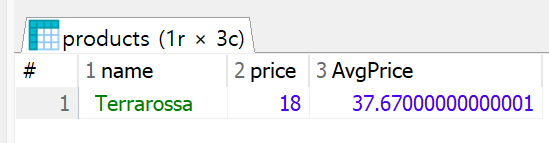

# 복습
```sql
SELECT u.id, u.username, u.phone, od.order_id, od.product_id FROM users u LEFT JOIN orders o ON u.id = o.user_id JOIN orderdetails od ON u.id = od.id;
```
- FROM 내에선는 JOIN을 중첩해서 사용 가능 이상의 경우 첫 번째 JOIN의 ON 뒤에 두 번째 JOIN을 작성했다고 할 수 있다. 필요한 정보가 셋 이상의 테이블에 나뉘어 있어도 키 값을 기반으로 연결 할 수 있으면 한번에 조회 가능. 에제 쿼리는 LEFT JOIN으로 주문 정보가 없는 회원 주문 정보를 포함했고 INNER JOIN으로 orders / orderdetails의 교집합 정보만 출력
  - 그러나 orders에 주문을 해야 세부 사항이 나오기에 LEFT JOIN을 써도 무관

### 예제 : users와 orders를 하나로 결합하는데 회원 정보가 없는 주문정보도 출력
```sql
# 주문 내역이 있는 회원만 출력
SELECT * FROM users u RIGHT JOIN orders o ON o.user_id = u.id ORDER BY u.id;
```
이상의 경우 차집합 개념으로 볼 수 있는데 LEFT JOIN과 동일한 기능처럼 보이나 INNER JOIN과 값이 같다(=주문 내역이 없는 회원 정보는 출력 X)

그렇기에 LEFT JOIN과 동일 값을 만들기위해서는 테이블 순서를 바꿀 필요 존재. 이상과 같은 이유로 많은 기업은 RIGHT JOIN 대신 LEFT JOIN 권장. 먼저 나온 테이블이 기준이 되게 LEFT JOIN만 쓰거나 교집합을 위해 INNER JOIN만 사용

### 예제 : user와 orders의 모든 가능한 행 조합을 만드는 SQL 쿼리 작성
```sql
SELECT * FROM users u CROSS JOIN orders o ORDER BY u.id;
```
- CROSS JOIN은 두 집합을 조합해 만들 수 있는 카테시안 곱(cartesian product)을 출력. 순서는 u.id를 기준으로 작성
  - 모든 총합이 나오기에 LEFT / RIGHT / INNER JOIN처럼 u.id = o.user_id 같은 조건 없이 두 테이블의 모든 행을 합쳐 만들 수 있는 모든 경우 출력. 10개의 row를 지니는 테이블과 20개의 row를 지니튼 테이블을 CROSS JOIN 하면 10*20DMFH 200개의 row를 지니는 행이 나오고 이 외의 경우의 수는 존재 X(조건 없음)

이상의 이류로 실제 운영 환경은 CROSS JOIN을 제한하는 편으로 컴퓨터의 리소스를 너무 잡아먹고 실질적 쓸모 없음

CROSS JOIN과 유사하지만 조금 다른 FULL OUTER JOIN이 있는데

FULL OUTER JOIN = LEFT JOIN + RIGHT JOIN - INNER JOIN

# JOIN 정리
- JOIN은 복수의 테이블을 하나로 결합시 사용. 여러 곳에 기록된(정규화된) 데이터를 하나의 테이블로 합칠 때 필요

형식 :
```sql
FROM
  테이블1 a (LEFT/INNER) JOIN 테이블2 b
  ON a.PK = b.PK;
```
JOIN은 FROM 절에서만 수행. 그렇다면 가장 먼저 실행된다고 볼 수 있음. JOIN 이후 나머지 WHERE, GROUP BY, HAVING, SELECT, ORDER BY가 실행 전 FROM 절에서 지정한 표의 별칭을 이후 제어문에서 전부 사용 가능

또한 조건으로 나오듯 공통된 컬럼 값이 키 값이 존재해야지만 JOIN으로 결합 가능. 키 값은 여러개가 있을 수 있어 어떤값을 기준일지 ON에서 명시

JOIN 중첩하기 
```sql
FROM 테이블1 a
  (LEFT / INNER) JOIN
  테이블2 b
  ON a.PK = b.FK    # ON 뒤에 pk를 쓰는게 관례
  (LEFT / INNER) JOIN
  테이블3 c
  ON 조건 = c.FK;
```

- INNER JOIN : 각 테이블의 키 값이 일치하는 행만(교집합만) 출력. 가장 기본적인 default JOIN이기에 INNER 생략이 가능. 그러나 가독성 문제로 명시적으로 INNER을 작성할것을 권장

- LEFT (OUTER) JOIN : 왼쪽 테이블의 모든 데이터를 결과에 포함해 출력
- RIGHT (OUTER) JOIN : 오른쪽 테이블의 모든 데이터를 결과에 포함해 출력
- FULL OUTER JOIN : 좌우측 테이블의 모든 데이터를 결과에 포함시켜 출력(CROSS와의 차이점에 유의)

- CROSS JOIN
```sql
FROM 
  테이블1 a CROSS JOIN 테이블2 b
```
CROSS를 쓸거면 조건이 필요없어 테이블 별칭이 없어도 될 수 있으나 SELECT에서 필요한 컬럼만 뽑아낼때 쓰기에 조건이 없어도 별칭 지정

FULL OUTER JOIN은 조건에 부합할때만 결과값을 만들지만 CROSS JOIN은 모든 경우의 수를 출력

### 연습 문제
1. users와 staff를 참고해 회원 중 직원인 사람의 회원 아이디, 이메일, 거주 도시, 거주 국가, 성, 이름을 한 화면에 출력
```sql
SELECT u.user_id, u.username, u.city, u.country, s.last_name, s.first_name FROM user u INNER JOIN staff s ON u.id = s.user_id ORDER BY u.id;
```

2. staff와 orders를 참고해 직원 아이디가 3, 5번인 직원의 담당 주문 출력(단 직원 아이디, 직원 성, 주문 아이디, 주문 일자만 출력)
```sql
SELECT s.id, s.last_name, o.id, o.order_date FROM staff s LEFT JOIN orders o ON s.id = o.staff_id WHERE s.id IN (3, 5) ORDER BY s.id;
```

3. users와 orders를 참고해 회원 국가별 주문 건수를 내림차순으로 출력
```sql
SELECT country, COUNT(DISTINCT o.id) AS orderCnt FROM users u INNER JOIN orders o ON u.id = o.user_id GROUP BY country ORDER BY orderCNT DESC;
```

4. orders와 orderdetails, products를 참고해 회원 아이디별 주문 금액의 총 합을 정상 가격과 할인 가격 기준으로 각각 추출. 단 정상 가격 주문 금액의 총합 기준 내림차순
```sql
SELECT o.user_id, ROUND(SUM(p.price * p.quantity)) AS sumPrice, ROUND(SUM(p.discount_price * p.quantity)) AS sumDiscountPrice FROM orders o LEFT JOIN orderdetails od ON o.id = od.order_id INNER JOIN products p ON od.product_id = p.id GROUP BY o.user_id ORDER BY sumPrice DESC;
```

5. 다음 조건의 테이블이 있다고 가정할 시
  - 왼쪽 테이블 A : 컬럼 개수 5개 / 150행
  - 오른쪽 테이블 B : 컬럼 개수 7개 / 100행
  - 두 테이블은 공통 키 값 컬럼을 1개 보유

  이상의 조건의 두 테이블을 CROSS / LEFT / RIGHT / INNER JOIN으로 결합시 결과 테이블의 행과 열 개수를 계산
```sql
CROSS - 행 : 15000 / 열 : 12
LEFT - 행 : 150~15000 / 열 : 12
RIGHT - 행 : 100~15000 / 열 : 12
INNER - 행 : 0~150 / 열 : 12
```

# UNION
## 컬럼 목록이 같은 데이터를 위아래로 결합
- 데이터를 위아래로 수직결합을 지원하는 UNION은 컬럼의 형식과 개수가 같은 두 데이터 결과 집합을 하나로 합치는 것

- 조건을 설정해서 결합하는 JOIN과 달리 UNION은 컬럼의 형식 / 개수만 동일하면 결합 가능

예시 : users를 full scan한 결과 잡합해서 각 행 UNION 적용
```sql
(SELECT * FROM users)
UNION
(SELECT * FROM users);
```
이상의 쿼리 실행시 `SELECT * FROM users`와 결과가 동일. UNION은 중복 제거 기능 존재

예시 : users를 full scan했을 때 결과를 집합해서 UNION 적용(중복 제거 수행하지 않은 결과 출력)
```sql
(SELECT * FROM users) UNION ALL (SELECT * FROM users) ORDER BY id;
# UNION ALL 중복 제거를 않는 키워드 ALL
```

UNION의 기본 전제 : 컬럼의 형식 / 개수 -> SELECT 수행 이후에 커스텀한 컬럼에도 동일 적용
```sql
(SELECT * FROM users) UNION ALL (SELECT id, phone, country, city FROM users);
```

그렇기에 이상의 쿼리는 오류 발생. 결과적으로 SELECT수행 이후의 결과값을 기준으로 UNION이 실행(소괄호 부분이 먼저 수행). 그렇다면 각각의 소괄호1, 2의 연산 결과는 서로 다른 컬럼의 개수를 지녀 UNION ALL 연산 불가

연습 : users에서 country가 Korea인 회원 정보만 추출하고 Mexico인 회원 정보만 추출해 결합. 컬럼은 id, phone, city, country만 출력하고 최종 결과 집합은 country 기준 알파벳 정렬
```sql
(SELECT id, phone, country, city FROM users WHERE country = 'Korea') UNION ALL (SELECT id, phone, country, city FROM users WHERE country = 'Mexico') ORDER BY country;
```

## UNION 정리
- 컬럼 형식 / 개수 조정이 중요
- 중복 제거 포함
- 중복되도 무관하면 UNION ALL 사용

연습 문제 : 
1. orders에서 order_date가 2015년 10월인건과 2015년 12월인 건을 SELECT로 각각 추출하고 두 결과 집합을 UNION ALL로 결합(최신순 정렬)
```sql
(SELECT * FROM orders WHERE SUBSTR(order_date,1,7) = '2015-10') UNION ALL (SELECT * FROM orders WHERE SUBSTR(order_date,1,7) = '2015-12');
```

2. users에서 USA에 거주중이며 마케팅 수신 공의를 한 회원 정보와 France에서 거주중인데 동의하지 않은 회원 정보를 SELECT로 추출하고 결합(id, phone, country, city, is_marketing_agree만 출력하고 국가 기준 알파벳 정렬)
```sql
(SELECT id, phone, country, city FROM users WHERE country = 'USA' AND is_marketing_agree = 1) UNION ALL (SELECT id, phone, country, city FROM users WHERE country = 'France' AND is_marketing_agree = 0) ORDER BY country;
```

3. UNIINN을 활용해 orderdetailss와 products를 FULL OUTER JOIN으로 결합해 출력
```sql
(SELECT * FROM orderdetails od LEFT JOIN products p ON od.product_id = p.id ) UNION (SELECT * FROM products p RIGHT JOIN orderdetails od ON p.id = od.product_id);
```

# Sub Query
- SQL의 쿼리 결과를 테이블처럼 사용하는 쿼리 내부의 쿼리

- 기존 방식들은 데이터 결합시 이미 존재하는 테이블에 접근해 결합을 했지만 이제는 기존 테이블을 편집해 만든 결과값을 기준으로 다시 쿼리를 실행하는 형태.

즉 개발자가 작성한 쿼리를 실행해 나온 결과값을 테이블처럼 사용하거나 조건 또는 값으로 사용할 수 있는가에 대한 내용

서브 쿼리는 SELECT 문 내의 여러곳에서 사용이 되는데 사용하는 위치에 따라 이름이 다양. 그래서 서브쿼리 하나로 해결하지 못하고 어느 서브쿼리인지 구분 필요

### 예제 : products에서 제품명과 정상 가격을 모두 불러오고 평균 정상 가격을 새로운 컬럼으로 각 행마다 출력
```sql
SELECT name, price, (SELECT ROUND(AVG(price),2) FROM products) AS avgProduct FROM products;
```
`SELECT ROUND(AVG(price),2) FROM products`의 결과값은 전체 price들의 총합을 row 개수만큼 나눈 평균값에 해당

그리고 이상의 SELECT AVG(price) FROM products 쿼리 실행시 `row = 1 / column = 1`인 테이블이 하나 출력

이 단일 결과값이 나온 테이블을 
```sql
SELECT name, price, (SELECT ROUND(AVG(price),2) FROM products) AS avgProduct FROM products;
```
로 적용시 전체 테이블은 name, price, avgProduct로 이루어진 세 개읰 ㅓㄹ럼을 지닌 테이블이 나오는데 서브 쿼리의 결과가 하나의 값만 있어서 모든 row에 SELECT AVG(price) FROM products의 결과가 붙어서 출력

이처럼 SELECT절에는 단일 값을 반환하는 쿼리가 올 수 있고 스칼라(Scaalar) 서브 쿼리라고 호칭

결과 화면의 마지막 컬럼처럼 스칼라 서브 쿼리는 신규 컬럼으로 추가되 모든 행에 단일값 출력
```sql
SELECT name, price, 100.00 AS faekPrice FROM products;
# 오류 예시
SELECT name, price, AVG(price) AS AvgPrice FROM products;
```


이상의 경우처럼 첫 행만 출력되거나 DB에 따라서는 GROUP BY가 없는 상태라 오류 발생. 집계함수이기 때문

- 유의 사항 : 스칼라 서브 쿼리 작성시 단일 값이 반환되도록 작성. 만약 2개 이상의 집계값을 기존 테이블에 추가하려면 스칼라 서브 쿼리를 나눠서 작성

정상가 기준의 avgPrice avgDiscountPrice를 컬럼에 추가하려면 서브 쿼리 두개가 병렬로 구성
```sql
SELECT name, price, (SELECT ROUND(AVG(price),2) FROM products) AS avgProduct, (SELECT ROUND(AVG(discount_price), 2) FROM products) AS avgDiscountPirce FROM products;
```

### 예제 : users에서 city별 회원 수를 카운트하고 회원수가 3명 이상인 도시명과 회원수를 출력(회원수를 기준으로 내림차순 정렬)
```sql
# 1. HAVING
SELECT city, COUNT(DISTINCT id) AS pop FROM users GROUP BY city HAVING pop >= 3 ORDER BY pop DESC;

# 2. 서브쿼리
SELECT * FROM (SELECT city, COUNT(DISTINCT id) AS pop FROM users GROUP BY city) temp WHERE pop >= 3 ORDER BY pop DESC;
```
서브쿼리 작성시 이상처럼 작성

주요 사항
1. FROM 절 내에 서브쿼리 삽입 -> 편집이 이루어진 새로운 테이블을 기준으로 새로운 쿼리문 작성

2. 이상과 같은 FROM 절 내에 서브 쿼리가 들어가는 것을 인라인 뷰(Inline View)라고 호칭

## Inline View
특징 : 
1. 인라인 뷰 내에는 또 다른 서브 쿼리가 개수 제한 없이 중첩 적용 가능
2. 인라인 뷰의 서브 쿼리는 괄호 안에 작성한 쿼리의 결과값 자체를 테이블에 존재하는 데이터로 간주하고 이에 대한 로직 수행

그래서 위의 예시를 봄녀 서브 쿼리의 연산 결괴로 city / userCnt 라는 두 개의 컬럼이 생기고 city / userCnt라는 컬럼을 가진 테이블을 기준으로 SELECT *을 수행한거기에 최종 결과값에도 city / userCnt라는 컬럼이 존재하니 서브 쿼리 밖에서 WHERE userCnt > 2와 같은 조건에서도 연산 가능

그리고 HAVING 적용 버전과의 차이점은 HAVING을 통해 필터링 하면 GROUP BY 이후에 HAVING이 이루어지는 반면 inline view는 가장 먼저 연산 수행. 필터링 동일

## WHERE 절 내부의 서브쿼리
예제 : orders에서 staff를 활용해 last_name의 값이 kyle이나 scott인 직원의 담당 주문 출력(서브 쿼리 활용)
```sql
# 1. Join
SELECT s.id, s.last_name, s.first_name, s.birth_date, o.id, o.order_date FROM orders o LEFT JOIN staff s ON o.staff_id = s.id WHERE s.last_name	IN ('kyle', 'Scott') ORDER BY s.last_name;

# 2. 서브 쿼리
SELECT * FROM orders WHERE staff_id IN(SELECT id FROM staff WHERE last_name IN('Kyle', 'Scott'));
```
Kyle의 staff_id = 3이고 Scott의 staff_id = 5. 이를 통해 orders 테이블의 staff_id와 연결해 원하는 주문 정ㅇ보만 조회. WHERE staff_id IN()으로 작성했을 때 () 내부에 여러개의 데이터를 집어넣을 수 있어서 내부 결과물은 3, 5가 출력이 되고
```sql
SELECT * FROM orders WHERE staff_id IN(3,5)
```

### 예제 : products 에서 할인 가격이 가장 비싼 제품 출력
```sql
SELECT MAX(discount_price) FROM products
```
로 작성하면 가장 비싼 가격이 출력되는데 이를 WHERE로 적용하면
```sql
SELECT * FROM products WHERE discount_price = (SELECT MAX(discount_price) FROM products);
```
MXA() 적용값은 이미 product 테이블의 discount_price에 이미 존재하는 데이터고 이를 서브쿼리로 사용하면 
```sql
SELECT * FROM products WHERE discount_price = 499.99
```
와 동일

### 예제 : orders에서 주문 월이 2015년 7월인 주문정보를 orderdetails에서 개별 주문 수량이 50인 정보를 각가 서브쿼리로 작성하고 INNER JOIN으로 작성
```sql
SELECT * FROM (SELECT * FROM orders WHERE SUBSTR(order_date, 1, 7) = '2015-07') o INNER JOIN (SELECT * FROM orderdetails WHERE quantity >= 50) od ON o.id = od.order_id
```

## 서브 쿼리 정리
서브 쿼리는 결과값을 메인 쿼리에 값이나 조건으로 사용하고 싶을 때 사용. SELECT / FROM / WHERE 등 사용 위치에 따라 불리는 이름이 다르며 공통점은 () 내에 쿼리문 작성

1. SELECT절에서의 사용
  - SELEC는 단일 집계값을 신큐 컬럼으로 추가하기 위해 서브 쿼리를 사용. 여러 개의 쿼리를 추가하려면 여러개의 서브 쿼리를 작성. SELECT의 서브 쿼리는 메인 쿼리의 FROM에서 사용된 테이블이 아닌 테이블도 사용 가능해서 불필요한 JOIN을 줄일 수 있음
  - Scalar Sub Query

2. From절에서의 사용
  - FROM 절에서 사용되는 서브 쿼리는 Inlien View라고 하며 테이블에서 서브 쿼리의 결과값 사용 가능. FROM에서 두 개 이상의 서브 쿼리를 활용할경우 JOIN 수행 가능. 이때 Inline View에서 테이블을 하나 생성하는것과 같아서 테이블 명을 짓는게 중요. 적절한 활용시 적은 연산으로 같은 결과값 출력 가능

3. WHERE절에서의 사용
  - WHERE에서 필터링을 위한 조건 값을 설정하는데 활용. 결과값이 하나면 = 를 쓰고 복수면 IN (). IN 연산자로 서브쿼리로 다중 컬럼 비교시 서브 쿼리에서 추출하는 컬럼의 개수와 WHERE의 필터링 대상 컬럼 개수 일치 필요

### 연습 문제
1. products를 풀 스캔하고 할인 가격의 최대값 대비 해당 제품의 할인 가격의 비율을 구해 ratioPerMaxPrc 컬럼명으로 추가(소수점 3째자리까지 표시)
```sql
SELECT *, ROUND(discount_price/ (SELECT MAX(discount_price) FROM products), 3) AS ratioPerMaxPrc FROM products;
```
2. users에서 staff 테이블을 써서 거주 국가가 Korea/Italy면서 생년월일 1990-01-01 이전인 회원이자 직원인 사람의 정보 출력. 회원 아이디 / 연락처 / 거주 국가 /  직원 아이디 / 성 / 이름 출력
```sql
# 서브 쿼리
SELECT u.id, u.phone, u.country, s.id, s.last_name, s.first_name FROM (SELECT * FROM users WHERE country IN ('Korea', 'Italy')) u INNER JOIN (SELECT * FROM staff WHERE birth_date < '1990-01-01') s ON u.id = s.user_id;

# JOIN
SELECT u.id, u.phone, u.country, s.id, s.last_name, s.first_name FROM users u INNER JOIN staff s ON u.id = s.user_id WHERE country IN ('Korea', 'Italy') AND birth_date < '1990-01-01';
```

3. users를 활용해 country별 회원 수를 카운트하고 5명 이상인 국가만 출력(회원 수 기준 내림차순)
```sql
SELECT * FROM (SELECT country, COUNT(DISTINCT id) AS userCnt FROM users GROUP BY country) temp WHERE userCnt >= 5 ORDER BY userCnt DESC;
```

4. prodcuts에서 정상 가격이 저렴한 제품의 정보를 모두 출력
```sql
SELECT * FROM products WHERE price = (SELECT MIN(price) FROM products);
```

5. orders와 users로 2016년도에 주문 이력이 있는 회원 정보 모두 출력
```sql
SELECT * FROM users WHERE id IN(SELECT user_id FROM orders WHERE SUBSTR(order_date, 1, 4) = '2016');

SELECT DISTINCT u.* FROM (SELECT * FROM orders WHERE SUBSTR(order_date, 1, 4) = '2016') o INNER JOIN (SELECT * FROM users) u ON o.user_id = u.id
```